# Convolutional Neural Network for Intel Image Classification

- [English](README_EN.md)
- [Русский](README.md)

**Эффективная сверточная нейронная сеть**, достигающая **90% точности** на датасете Intel Image Classification всего за **15-30 эпох** обучения **без использования предобученных сетей** с комплексным мониторингом метрик.

- [Результаты](#результаты)
- [Архитектура](#архитектура)

  - [ Оптимизатор](#оптимизатор)

- [Метрики](#метрики)
- [TensorBoard](#tensorboard)

  - [Scalars](#scalars)
  - [PR-Curves](#pr-curves)
  - [Confusion Matrix](#confusionmatrix)
  - [Histograms](#histograms)
  - [Distributions](#distributions)

- [Установка](#установка)
- [Использование](#использование)
- [Зависимости](#зависимости)

## Результаты

- **90.07% точность**
- **Быстрая сходимость**: 89%+ accuracy всего за 12-30 эпох
- **ResNet-подобная архитектура**, реализованная **с нуля**
- **Исчерпывающий мониторинг** через TensorBoard
- **Отличные PR-кривые** и гистограммы
- **Overfitting gap** всего **0.17%**

## Архитектура

<details><summary>Полная диаграмма</summary>

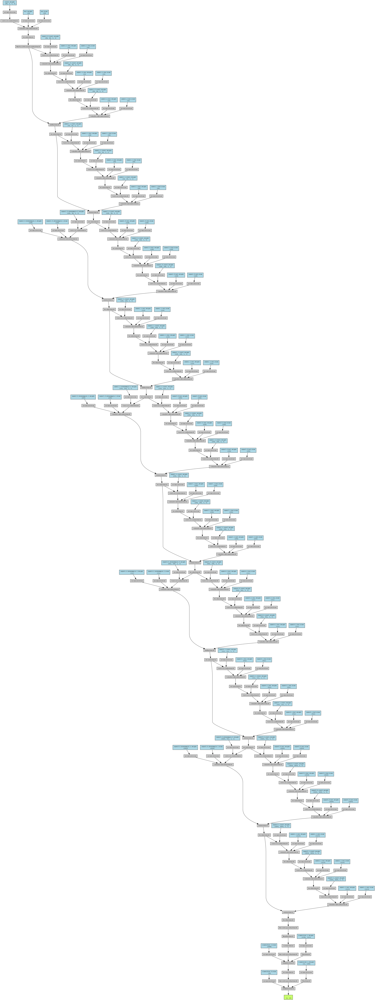

---

</details>

---


### Оптимизатор

Были испытаны различные оптимизаторы, включая PNMBelief, DiffPNM, Adam, AdamW, SGD, NSGD. В результате тестирования и тонкой настройки выявлено, что оптимизаторы с положительно-отрицательной оценкой момента не дают прироста точности для данной модели. Оптимизаторы типа SGD и Nesterov SGD также не показали преимуществ ни в точности, ни в скорости сходимости.

Лучшим оптимизатором оказался AdamW, достигший максимальной точности 90.07% с наибольшей скоростью сходимости. Модель с оптимизатором AdamW достигает около 89% точности всего за 12-30 эпох, что значительно быстрее других оптимизаторов, отстающих в среднем на 10-15 эпох при аналогичных условиях.

Опытным путем определены оптимальные параметры:

```bash
  num_epochs: 30
  batch_size: 40

  learning_rate: 0.000375
  beta0: 0.915
  beta1: 0.985
  weight_decay: 0.0017
```

## Метрики

Проект включает исчерпывающий набор метрик и визуализаций:

### TensorBoard

- **Confusion Matrix** - матрица ошибок с абсолютными и нормализованными значениями
- **PR-Curves** - Precision-Recall кривые с хорошим покрытием
- **Weight/Bias/Gradient гистограммы и распределения** для всех слоев модели
- **Основные метрики** loss и accuracy для train и test

### Scalars

<div align="center">

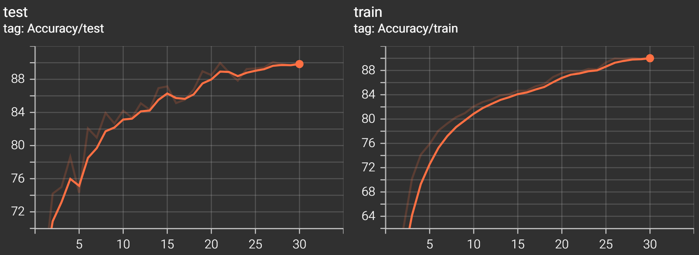

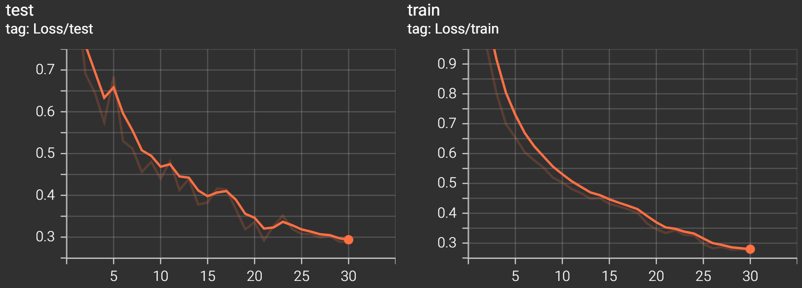

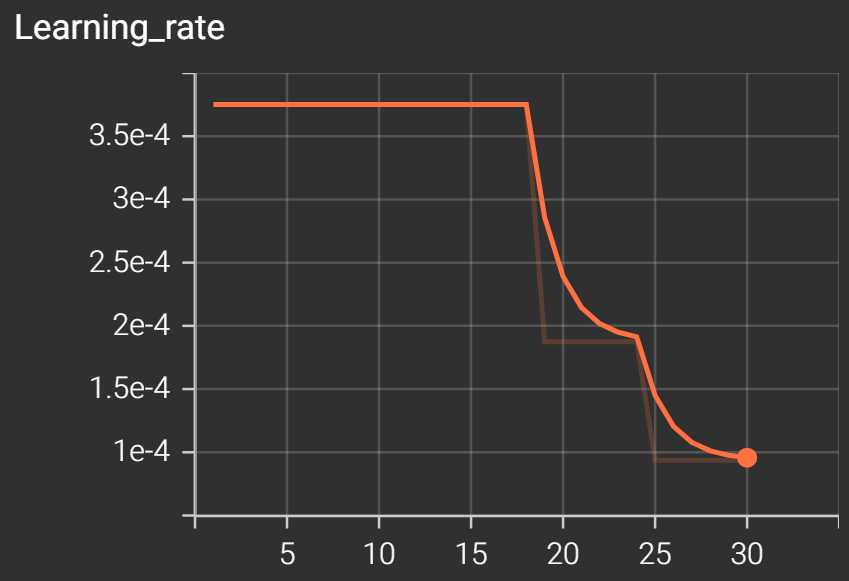

</div>

### PR-Curves

<div align="center" style="display: flex; flex-wrap: wrap; justify-content: center; gap: 10px;">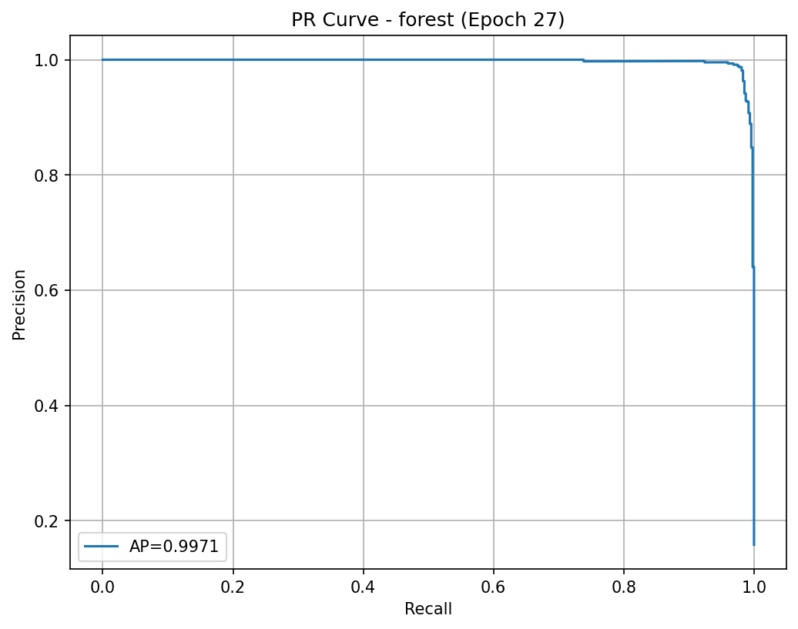 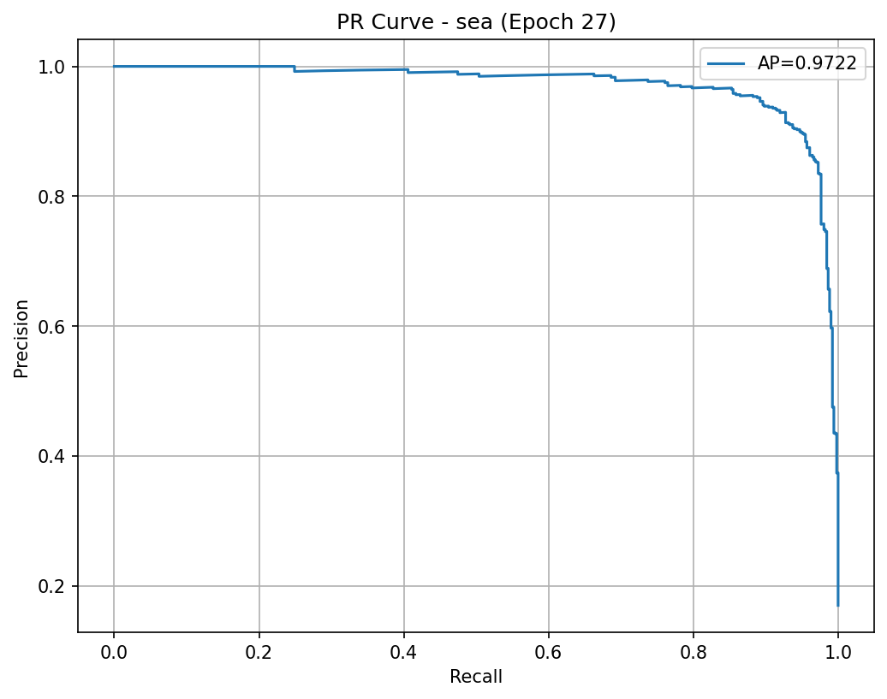 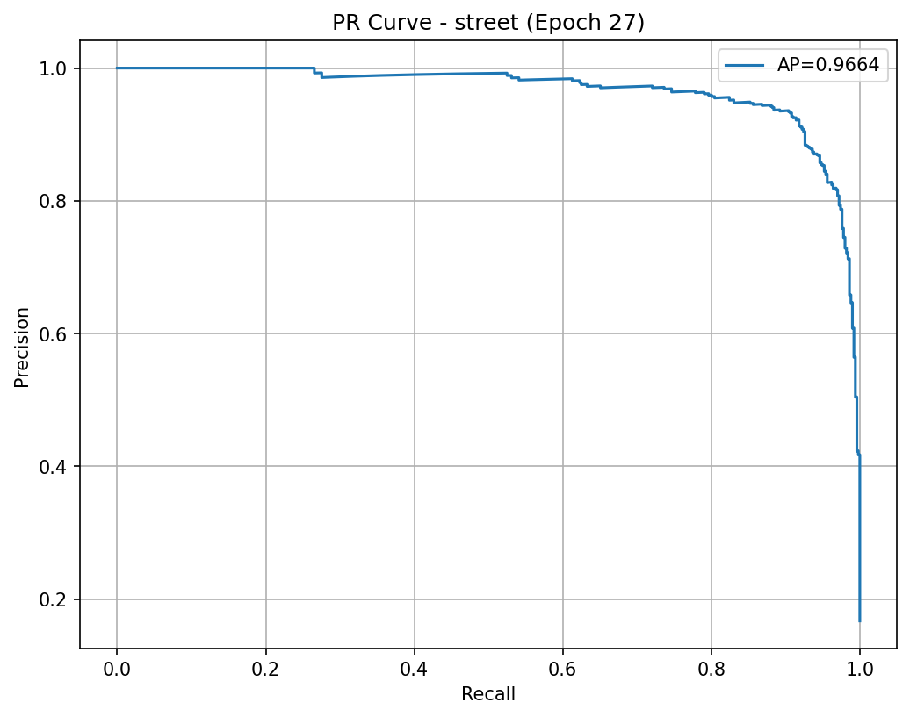</div>

### Confusion Matrix

<div align="center">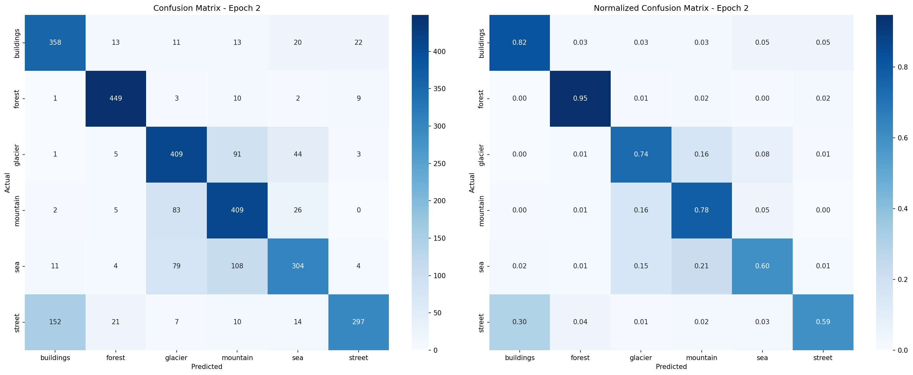 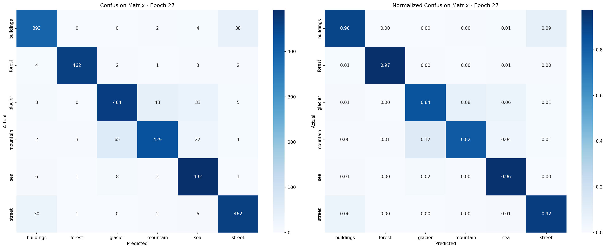

_Матрицы ошибок на 2-й и 27-й эпохах_

</div>

### Histograms

<div align="center">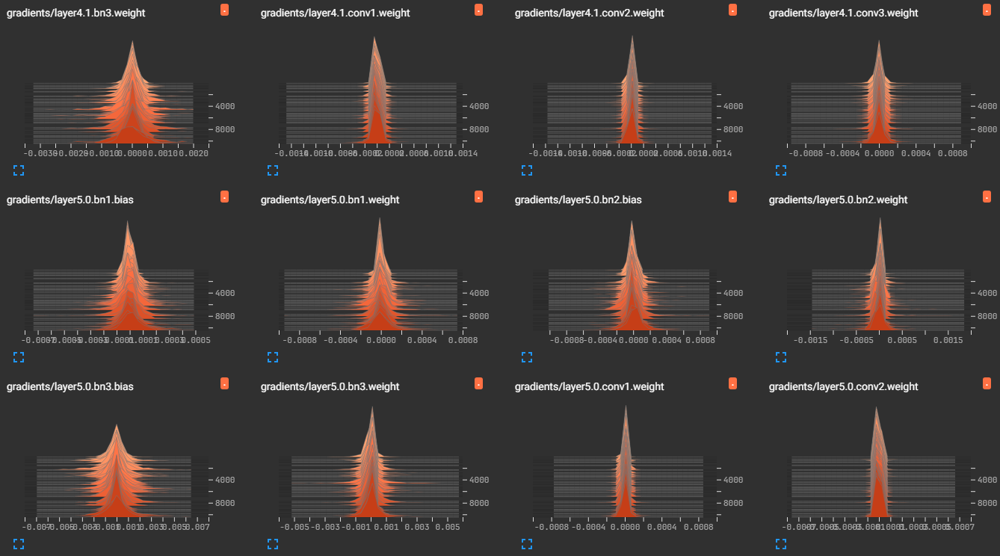 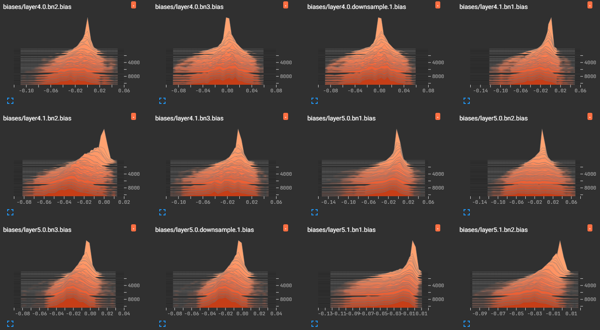

_Гистограммы градиентов и смещений_

</div>

### Distributions

<div align="center">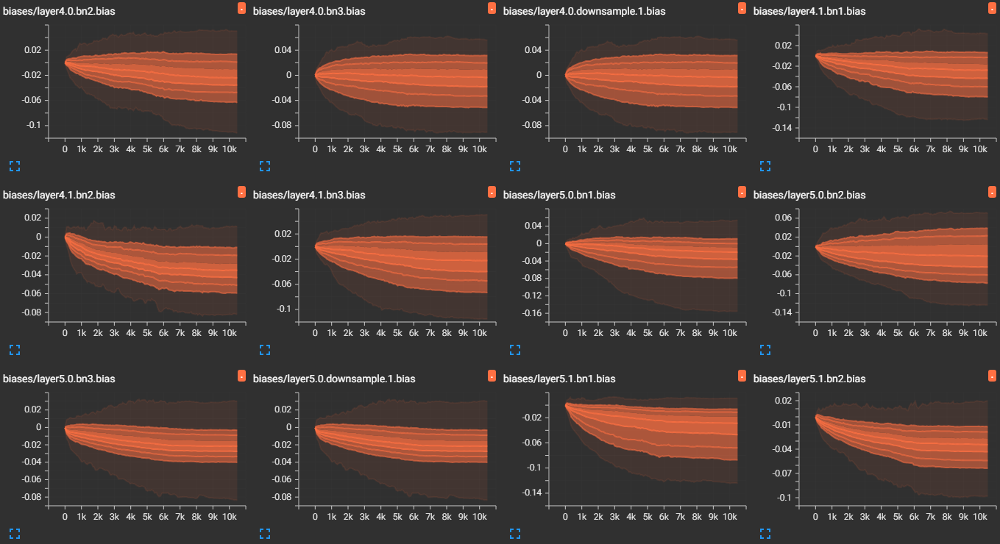
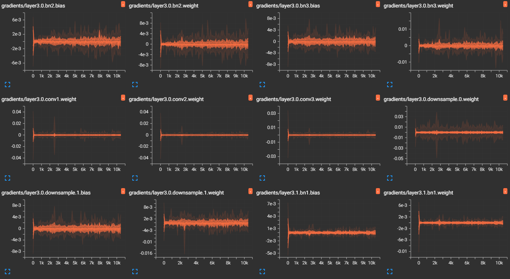

_Распределения смещений и градиентов_

</div>

## Установка

```bash
poetry install
```

## Использование

```bash
python scripts/train.py

tensorboard --logdir=outputs/logs

python scripts/predict.py
```

## Зависимости

- Python >=3.13,<3.15
- NumPy (>=2.3.5,<3.0.0)
- Tqdm (>=4.67.1,<5.0.0)
- Torch (>=2.9.1,<3.0.0)
- Torchvision (>=0.24.1,<0.25.0)
- Scikit-learn (>=1.7.2,<2.0.0)
- Tensorboard (>=2.20.0,<3.0.0)
- Torchviz (>=0.0.3,<0.0.4)
